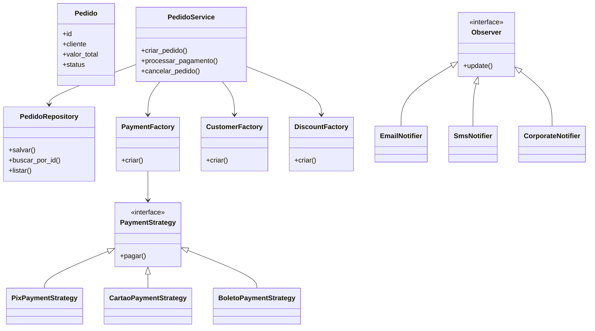

# Arquitetura Refatorada do Sistema

A aplicação foi refatorada utilizando arquitetura em camadas, padrões GoF e princípios SOLID com o objetivo de reduzir acoplamento, melhorar extensibilidade e facilitar manutenção do sistema legado.

## Estrutura Geral

```text
legacy.py
    ↓
PedidoService
    ↓
PedidoRepository
    ↓
SQLite
```

## Fluxo de Pagamentos

```text
legacy.py
    ↓
PedidoService
    ↓
PaymentFactory
    ↓
PaymentStrategy
        ├── CartaoPaymentStrategy
        ├── PixPaymentStrategy
        └── BoletoPaymentStrategy
```

## Fluxo de Notificações

```text
PedidoService
    ↓
NotificationManager
    ↓
Observers
    ├── EmailNotifier
    ├── SMSNotifier
    └── CorporateNotifier
```

## Camadas Criadas

### Models
Responsáveis pelas entidades do domínio.

Exemplo:
- `Pedido`
- `ItemPedido`

### Repositories
Responsáveis pela persistência e acesso ao banco de dados.

Exemplo:
- `PedidoRepository`

### Services
Responsáveis pelas regras de negócio.

Exemplo:
- `PedidoService`

### Strategies
Responsáveis por comportamentos intercambiáveis.

Exemplo:
- estratégias de pagamento

### Factories
Responsáveis pela criação centralizada de objetos.

Exemplo:
- `PaymentFactory`

### Observers
Responsáveis pelo desacoplamento de notificações e eventos.

Exemplo:
- `EmailNotifier`
- `SMSNotifier`
- `CorporateNotifier`

## Benefícios Arquiteturais Obtidos

- Redução de acoplamento
- Separação de responsabilidades
- Extensibilidade
- Facilidade de manutenção
- Maior testabilidade
- Refatoração segura através de testes automatizados
- Preservação do comportamento legado

---

# Diagrama UML

